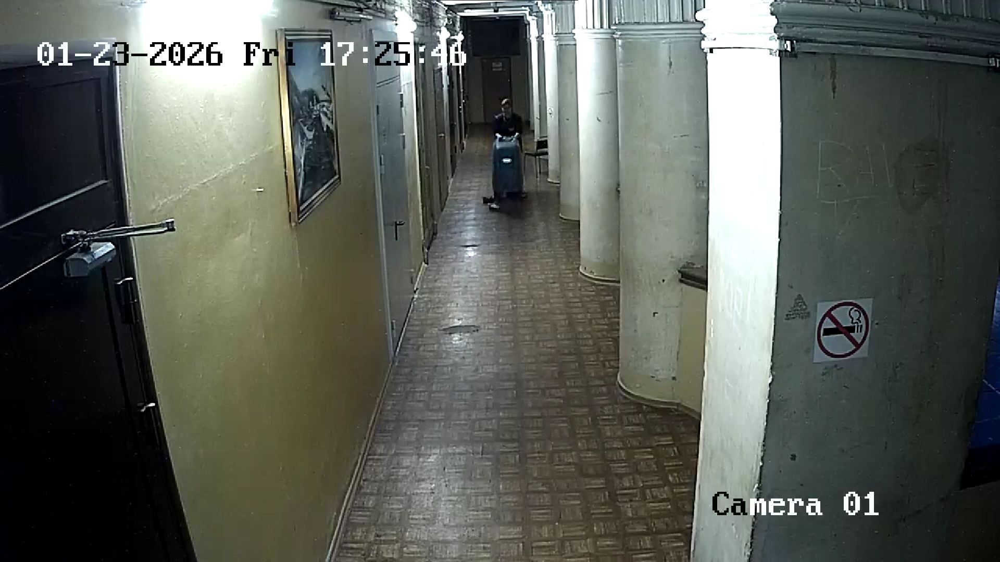
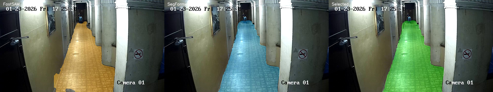
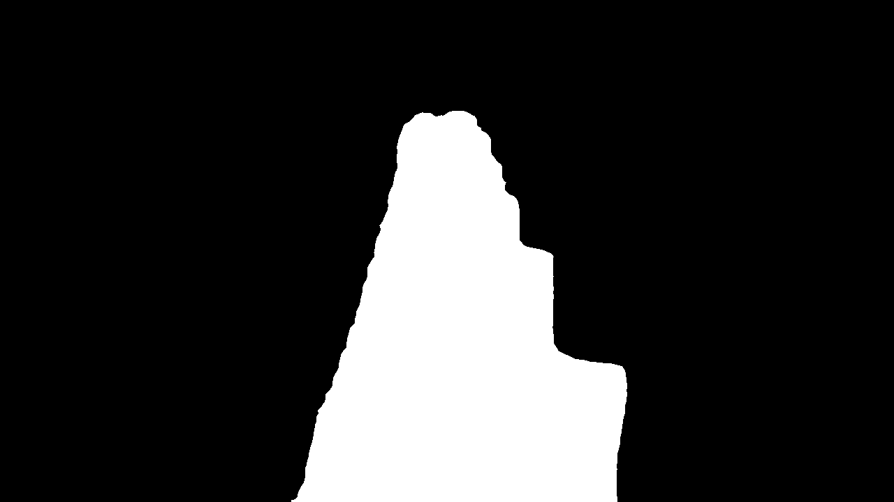
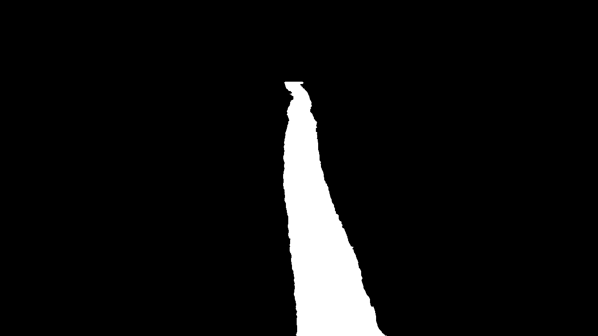
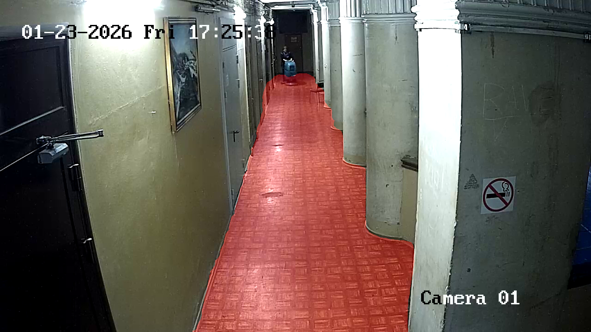

# Cleaning Analytic Module

Система видеоаналитики для определения рабочей зоны пола и оценки площади, обработанной поломоечной машиной.

## Основная идея

Модуль автоматически определяет постоянную геометрию пола на видео, отслеживает движение поломоечной машины и рассчитывает процент покрытой площади.

## Демонстрация работы

### Исходный кадр

Модуль начинает обработку с исходного кадра без разметки.

<p align="center">
  
</p>

### Ансамблевая сегментация

FastSAM и SegFormer независимо формируют кандидаты области пола.  
Ансамбль сравнивает результаты моделей и выбирает итоговый вариант на основе геометрического качества, согласованности и временной стабильности.

<p align="center">
  
</p>

### Итоговые маски

После выбора области пола формируются итоговая маска рабочей зоны и накопительная траектория поломоечной машины.

<table>
  <tr>
    <td align="center"><b>Маска пола</b></td>
    <td align="center"><b>Траектория машины</b></td>
  </tr>
  <tr>
    <td align="center">
      
    </td>
    <td align="center">
      
    </td>
  </tr>
</table>

### Итоговое наложение

Выбранная маска пола накладывается на исходный кадр и используется как рабочая область для дальнейшего расчёта покрытия.

<p align="center">
  
</p>

Для сегментации были протестированы четыре подхода:

- **FastSAM** — instance segmentation
- **SegFormer** — semantic segmentation
- **OneFormer** — panoptic segmentation
- **CLIPSeg** — zero-shot segmentation по текстовому запросу

По результатам тестирования в итоговый ансамбль были включены **FastSAM и SegFormer**, так как они показали лучшие и наиболее стабильные значения IoU.

## Результаты

| Видео | FastSAM v4 | SegFormer | OneFormer | CLIPSeg |
|---|---:|---:|---:|---:|
| Видео 1 | 0.9310 | **0.9582** | 0.9100 | 0.9280 |
| Видео 2 | 0.9717 | **0.9728** | 0.9478 | 0.9274 |
| Видео 3 | **0.9530** | 0.9265 | 0.9498 | 0.9115 |

Метрика: **IoU (Intersection over Union)**.

## Датасет

Для сравнения архитектур был создан собственный датасет из **36 вручную размеченных кадров**, выбранных из трёх исходных видео.

Разметка выполнялась в **CVAT** с классом `floor`.

В маску пола включались также области, временно перекрытые человеком или поломоечной машиной. Это позволяет модели определять постоянную геометрию помещения, а не только видимую свободную часть пола.

## Как работает модуль

После загрузки моделей и видео модуль:

1. Выбирает 7 кадров из первых 4 секунд видео.
2. FastSAM формирует кандидаты области пола по сегментации, расположению и HSV-признакам.
3. SegFormer независимо строит семантическую маску пола.
4. Все маски проходят морфологическую обработку и геометрическую валидацию.
5. Ансамбль выбирает один из вариантов:
   - FastSAM;
   - SegFormer;
   - пересечение масок;
   - объединение масок.
6. Выбор производится по геометрическому качеству, согласованности моделей и временной стабильности.
7. Итоговая маска фиксируется для всего видео.
8. Модуль строит накопительную траекторию поломоечной машины и восстанавливает короткие пропуски детекции.
9. Траектория ограничивается областью пола.
10. Рассчитывается перспективно-взвешенный процент покрытой площади.

## Структура для локального запуска

```text
project/
├── CleaningAnalyticModule_v7.py
├── yolo26m_2v.pt
├── FastSAM-s.pt
└── video.mp4
